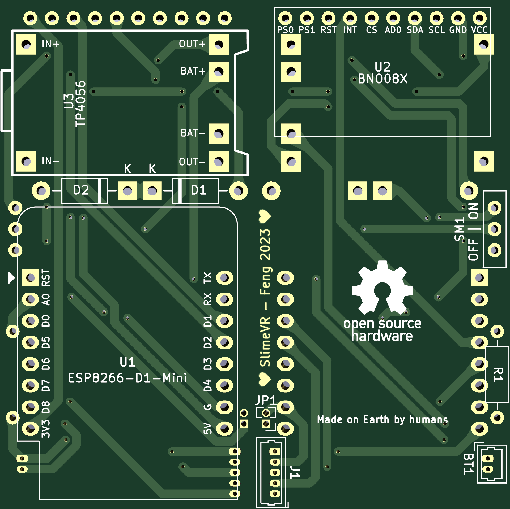
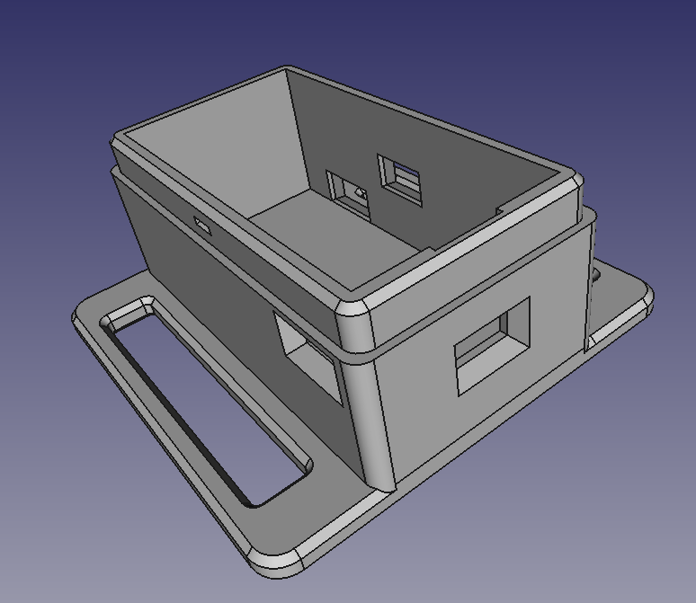

# SlimeVR-Hardware

This is a SlimeVR hardware project, including a PCB file and case models.

## Feature

* Using modules instead of SMD, the parts are consistent with the [schematics of the official document](https://docs.slimevr.dev/diy/tracker-schematics.html)
* The wiring method is consistent with the schematics of the official document too, no need to change the pin definition.
* Battery sense
* Charge diodes
* Auxiliary tracker connector (optional)

## Build your own trackers

### Prepare the parts

First, prepare the following materials:

| Designator | Materials                                      | Quantity | Comment                                               |
| ---------- | ---------------------------------------------- | -------- | ----------------------------------------------------- |
| U1         | ESP8266-D1-Mini                                | 1        | Also called WeMos D1 Mini, Type-C is recommended      |
| U2         | BNO08X                                         | 1        | IMU, BNO085/BNO080                                    |
| U3         | TP4056                                         | 1        | TP4056, Type-C is recommended                         |
| D1, D2     | 1N5817                                         | 2        | Charge diodes                                         |
| R1         | 180k 1/4W resistor                             | 1        | Battery sense                                         |
| SM1        | MSK-12D19 (1P2T)                               | 1        | Toggle Switch                                         |
| BT1        | Molex PicoBlade connector 1x2p 1.25mm vertical | 1        | This is a common connector type for lithium batteries |
|            | 3.7v lithium battery                           | 1        | 10*25*40mm (102540) is recommended                    |
| J1         | Molex PicoBlade connector 1x5p 1.25mm vertical | 1        | Auxiliary tracker connector (this is an optional)     |
| JP1        | PinHeader 1x2p 1.27mm vertical                 | 1        | Pinheader for jumper (this is an optional)            |

Then you need to download the [Gerber.zip](https://github.com/R-Josef/SlimeVR-Hardware/releases/latest/download/Gerber.zip) file, provide this file to the PCB manufacturer to make your boards.

Finally, download the [Case.stl](https://github.com/R-Josef/SlimeVR-Hardware/releases/latest/download/Case.stl) file and [Lip.stl](https://github.com/R-Josef/SlimeVR-Hardware/releases/latest/download/Lip.stl) file and use it for 3d printing, you will get cases.

### Soldering

Solder the parts that need to be soldered to the PCB, Your board should now look like this:


You can now connect the D1 Mini to your computer with a USB cable, and then burn the firmware. If everything is ok, you can plug the lithium battery into the connector:


Last step, put the tracker in the box and snap the lid on, you may need Hot-melt adhesive to hold it in place. Now your tracker is ready, enjoy it!

### About auxiliary tracker

If you need to connect a auxiliary tracker, you should use this case with a hole: [Case-AuxHole.stl](https://github.com/R-Josef/SlimeVR-Hardware/releases/latest/download/Case-AuxHole.stl) [Lip-AuxHole.stl](https://github.com/R-Josef/SlimeVR-Hardware/releases/latest/download/Lip-AuxHole.stl) , the extra hole is used to pass the connecting wire of the auxiliary tracker. In order to use the auxiliary tracker, you need also to solder J1 and JP1 to the PCB, then prepare a jumper cap, and insert the jumper cap on JP1.

## Configuring the Firmware

You can clone or download the firmware on [official frimware repo](https://github.com/SlimeVR/SlimeVR-Tracker-ESP) , if you don't use auxiliary tracker, just make the following changes in `defines.h` :

```c
#define BOARD BOARD_WEMOSD1MINI
#define IMU_ROTATION DEG_180
```

If you use auxiliary tracker, then also need to make the following changes in `defines.h` :

```c
#define SECOND_IMU BNO085
#define SECOND_IMU_ROTATION DEG_0
```

For other settings, please follow the [official documentation](https://docs.slimevr.dev/).

## View or modify source files

The SlimeVR-PCB folder is the KiCad project folder, while the SlimeVR-Case folder has the FreeCAD model files for the case and lid.

## preview

### PCB




### Case


